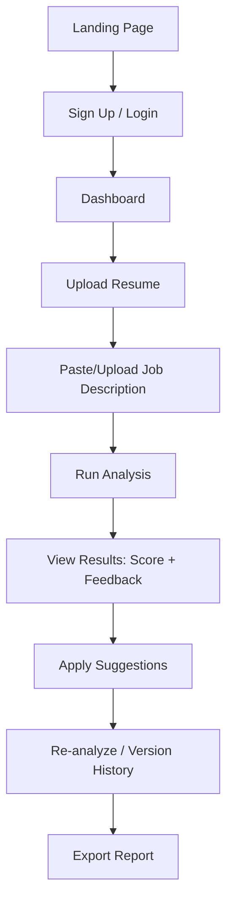
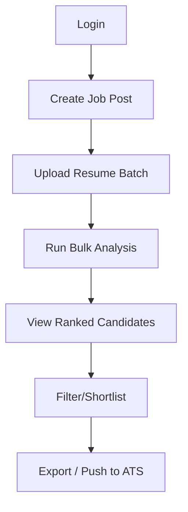
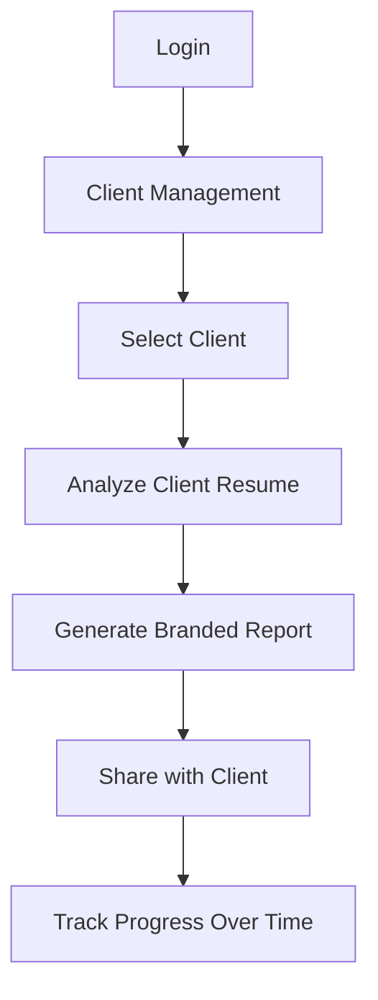

# Software Requirements Specification (SRS)
## AI Resume Analyzer Web Application

---

## 1. Project Overview

**Project Name:** AI Resume Analyzer  
**Version:** 1.0.0  
**Status:** Planning Phase  
**Document Version:** 1.0  

### 1.1 Purpose
The AI Resume Analyzer is a production-ready web application that leverages artificial intelligence to analyze, score, and provide actionable feedback on resumes/CVs. It helps job seekers optimize their resumes for specific roles and helps recruiters quickly screen candidates.

### 1.2 Scope
- **In Scope:** Resume parsing, AI-powered analysis, scoring engine, job matching, feedback generation, user authentication, dashboard, API for integrations
- **Out of Scope:** Resume building from scratch, video interview analysis, salary negotiation tools, applicant tracking system (ATS) replacement

### 1.3 Definitions & Acronyms
- **ATS:** Applicant Tracking System
- **LLM:** Large Language Model
- **NLP:** Natural Language Processing
- **CV:** Curriculum Vitae
- **JD:** Job Description
- **PII:** Personally Identifiable Information

---

## 2. Problem Statement

### 2.1 Current Pain Points
1. **Job Seekers:** Spend hours tailoring resumes without knowing if they pass ATS filters or match job requirements
2. **Recruiters:** Manually screen hundreds of resumes; inconsistent evaluation criteria; bias in manual review
3. **Career Coaches:** Lack scalable tools to provide data-driven resume feedback to multiple clients
4. **Universities/ Bootcamps:** No standardized way to assess graduate resume readiness

### 2.2 Solution
An AI-powered platform that:
- Parses resumes in multiple formats (PDF, DOCX, TXT)
- Analyzes against job descriptions using semantic matching
- Provides ATS compatibility scoring
- Generates actionable, prioritized improvement suggestions
- Tracks resume versions and progress over time

---

## 3. Target Users

### 3.1 Primary Users
| User Type | Description | Key Needs |
|-----------|-------------|-----------|
| **Job Seekers** | Active/passive candidates across all experience levels | Resume optimization, job match scoring, interview prep |
| **Recruiters/HR** | Talent acquisition professionals, hiring managers | Bulk screening, candidate ranking, bias reduction |
| **Career Coaches** | Professional resume writers, career counselors | Client management, progress tracking, white-label reports |

### 3.2 Secondary Users
- **Educational Institutions:** Career services departments
- **Recruitment Agencies:** High-volume screening
- **Enterprise HR:** Internal mobility, referral programs

### 3.3 User Personas
1. **Sarah (Senior Developer):** 8 years exp, targeting FAANG roles, needs keyword optimization
2. **Marcus (Recruiter):** Screens 50+ resumes/day for 5 open roles, needs quick ranking
3. **Priya (Career Coach):** Manages 20 clients, needs branded reports and progress dashboards

---

## 4. Features

### 4.1 Core Features (MVP)
| Feature ID | Feature | Description | Priority |
|------------|---------|-------------|----------|
| F-001 | Resume Upload & Parsing | Drag-and-drop upload (PDF, DOCX, TXT), extract text/structure | P0 |
| F-002 | Job Description Input | Paste JD text or upload JD file, extract requirements | P0 |
| F-003 | AI Analysis Engine | Semantic matching, skills gap analysis, experience relevance | P0 |
| F-004 | ATS Compatibility Score | Check formatting, keywords, sections, parsing reliability | P0 |
| F-005 | Overall Match Score | 0-100 score with breakdown (skills, experience, education, keywords) | P0 |
| F-006 | Actionable Feedback | Prioritized suggestions with examples (add/remove/modify) | P0 |
| F-007 | User Authentication | Email/password, OAuth (Google, LinkedIn, GitHub), JWT tokens | P0 |
| F-008 | Dashboard | History, version comparison, progress tracking | P0 |
| F-009 | Export Reports | PDF/JSON export of analysis results | P0 |

### 4.2 Enhanced Features (Post-MVP)
| Feature ID | Feature | Description | Priority |
|------------|---------|-------------|----------|
| F-010 | Bulk Resume Analysis | Upload multiple resumes + single JD, get ranked results | P1 |
| F-011 | Resume Builder | AI-assisted resume creation from scratch | P1 |
| F-012 | Interview Question Generator | Generate behavioral/technical questions based on resume+JD | P1 |
| F-013 | Salary Benchmarking | Market rate data for role/location/experience | P2 |
| F-014 | Team/Org Workspaces | Shared libraries, templates, admin controls | P1 |
| F-015 | API Access | REST/GraphQL API for integrations | P1 |
| F-016 | White-label Reports | Custom branding for coaches/agencies | P2 |
| F-017 | ATS Integration | Direct push to Greenhouse, Lever, Workday | P2 |
| F-018 | Mobile App | React Native / Flutter companion app | P3 |

---

## 5. User Flow

### 5.1 Job Seeker Flow (Primary)


### 5.2 Recruiter Flow


### 5.3 Career Coach Flow


---

## 6. Functional Requirements

### 6.1 Resume Processing (FR-RES)
| ID | Requirement | Details |
|----|-------------|---------|
| FR-RES-001 | Support PDF, DOCX, TXT upload | Max 10MB, validate file type via magic bytes |
| FR-RES-002 | Extract structured data | Name, contact, summary, experience, education, skills, projects, certifications |
| FR-RES-003 | Handle multi-column layouts | Preserve reading order, detect columns |
| FR-RES-004 | OCR for scanned PDFs | Tesseract fallback for image-based PDFs |
| FR-RES-005 | PII detection & masking | Option to mask name/email/phone before AI processing |
| FR-RES-006 | Version control | Store each upload as new version, diff view |

### 6.2 Job Description Processing (FR-JD)
| ID | Requirement | Details |
|----|-------------|---------|
| FR-JD-001 | Accept text input & file upload | Paste, PDF, DOCX, URL fetch |
| FR-JD-002 | Extract structured requirements | Required/preferred skills, experience years, education, certifications, soft skills |
| FR-JD-003 | Normalize skill names | Map synonyms (e.g., "JS" → "JavaScript", "K8s" → "Kubernetes") |
| FR-JD-004 | Save JD templates | Reusable job profiles for recurring roles |

### 6.3 AI Analysis Engine (FR-AI)
| ID | Requirement | Details |
|----|-------------|---------|
| FR-AI-001 | Semantic similarity scoring | Embedding-based (sentence-transformers) + LLM reranking |
| FR-AI-002 | Skills gap analysis | Missing required skills, missing preferred skills, skill proficiency inference |
| FR-AI-003 | Experience relevance | Map candidate experience to JD requirements, calculate years match |
| FR-AI-004 | Education matching | Degree level, field relevance, institution tier (optional) |
| FR-AI-005 | Keyword density analysis | ATS-critical keywords presence, frequency, placement |
| FR-AI-006 | Section completeness | Detect missing standard sections (summary, skills, etc.) |
| FR-AI-007 | Formatting/ATS checks | Fonts, tables, columns, headers/footers, graphics, special chars |
| FR-AI-008 | Actionable feedback generation | LLM-generated specific suggestions with before/after examples |
| FR-AI-009 | Confidence scoring | Per-section confidence, flag low-confidence analyses |
| FR-AI-010 | Multi-language support | English (MVP), Spanish, French, German (Post-MVP) |

### 6.4 Scoring System (FR-SCORE)
| ID | Requirement | Details |
|----|-------------|---------|
| FR-SCORE-001 | Overall match score (0-100) | Weighted: Skills 35%, Experience 30%, Keywords 20%, Education 10%, Format 5% |
| FR-SCORE-002 | Sub-scores breakdown | Visual radar chart, percentile vs. benchmarks |
| FR-SCORE-003 | ATS compatibility score (0-100) | Separate from match score, focuses on parsability |
| FR-SCORE-004 | Score explanations | Tooltip/expandable details for each component |
| FR-SCORE-005 | Historical tracking | Score trend line across versions |

### 6.5 Feedback & Recommendations (FR-FB)
| ID | Requirement | Details |
|----|-------------|---------|
| FR-FB-001 | Prioritized suggestions | Critical > High > Medium > Low impact |
| FR-FB-002 | Specific examples | "Add 'React' to Skills section" not "Add more skills" |
| FR-FB-003 | Before/after snippets | Show exact text changes |
| FR-FB-004 | Categorized feedback | Skills, Experience, Formatting, Keywords, Structure |
| FR-FB-005 | Quick-fix actions | One-click "Add missing keyword" for simple additions |

### 6.6 User Management (FR-USER)
| ID | Requirement | Details |
|----|-------------|---------|
| FR-USER-001 | Email/password auth | bcrypt, min 12 chars, breached password check (HaveIBeenPwned) |
| FR-USER-002 | OAuth providers | Google, LinkedIn, GitHub, Microsoft |
| FR-USER-003 | Email verification | Required before first analysis |
| FR-USER-004 | Password reset | Secure token, 1-hour expiry |
| FR-USER-005 | Subscription tiers | Free (5 analyses/mo), Pro (unlimited), Team, Enterprise |
| FR-USER-006 | Role-based access | User, Coach, Recruiter, Admin |
| FR-USER-007 | Data export/deletion | GDPR/CCPA compliant, 30-day grace period |

### 6.7 Dashboard & History (FR-DASH)
| ID | Requirement | Details |
|----|-------------|---------|
| FR-DASH-001 | Analysis history table | Date, resume name, JD title, overall score, ATS score, status |
| FR-DASH-002 | Version comparison | Side-by-side diff, score delta, feedback delta |
| FR-DASH-003 | Progress visualization | Score trend, skills acquired over time |
| FR-DASH-004 | Saved JDs library | Search, filter, duplicate, archive |
| FR-DASH-005 | Resume library | Tag, organize, duplicate, delete |

### 6.8 Export & Sharing (FR-EXP)
| ID | Requirement | Details |
|----|-------------|---------|
| FR-EXP-001 | PDF report | Professional layout, branded, include/exclude sections |
| FR-EXP-002 | JSON export | Full analysis data for programmatic use |
| FR-EXP-003 | Shareable link | Time-limited, password-protected, view-only |
| FR-EXP-004 | Coach/recruiter branded reports | Custom logo, colors, footer (Team+) |

### 6.9 API (FR-API)
| ID | Requirement | Details |
|----|-------------|---------|
| FR-API-001 | REST API v1 | OpenAPI 3.1 spec, rate limiting, API keys |
| FR-API-002 | Webhooks | Analysis complete, score threshold met |
| FR-API-003 | Bulk analysis endpoint | Async job with status polling |
| FR-API-004 | SDKs | Python, JavaScript/TypeScript official SDKs |

---

## 7. Non-Functional Requirements

### 7.1 Performance
| ID | Requirement | Target |
|----|-------------|--------|
| NFR-PERF-001 | Resume parsing time | < 3 seconds (typical 2-page PDF) |
| NFR-PERF-002 | AI analysis time | < 15 seconds (single resume + JD) |
| NFR-PERF-003 | Bulk analysis (50 resumes) | < 60 seconds |
| NFR-PERF-004 | API response time (p95) | < 500ms |
| NFR-PERF-005 | Page load time (dashboard) | < 2 seconds |
| NFR-PERF-006 | Concurrent users | 10,000+ (horizontal scaling) |

### 7.2 Reliability
| ID | Requirement | Target |
|----|-------------|--------|
| NFR-REL-001 | Uptime | 99.9% (monthly) |
| NFR-REL-002 | Data durability | 99.999999999% (11 9's) |
| NFR-REL-003 | Backup frequency | Daily automated, point-in-time recovery |
| NFR-REL-004 | Error rate | < 0.1% for critical paths |
| NFR-REL-005 | Graceful degradation | Queue analysis if AI service down, serve cached results |

### 7.3 Security
| ID | Requirement | Details |
|----|-------------|---------|
| NFR-SEC-001 | Data encryption | TLS 1.3 in transit, AES-256 at rest |
| NFR-SEC-002 | PII handling | Never log PII, automatic redaction in logs |
| NFR-SEC-003 | AI data privacy | Zero-retention policy with LLM providers (OpenAI, Anthropic) |
| NFR-SEC-004 | Authentication | JWT with short expiry (15min), refresh tokens (7 days) |
| NFR-SEC-005 | Rate limiting | Per-user, per-IP, per-API-key tiers |
| NFR-SEC-006 | Input validation | Strict validation, sanitization, file type verification |
| NFR-SEC-007 | Security headers | CSP, HSTS, X-Frame-Options, Referrer-Policy |
| NFR-SEC-008 | Vulnerability scanning | SAST/DAST in CI/CD, dependency scanning |
| NFR-SEC-009 | Audit logging | All data access, auth events, admin actions |
| NFR-SEC-010 | Compliance | SOC 2 Type II, GDPR, CCPA ready |

### 7.4 Scalability
| ID | Requirement | Target |
|----|-------------|--------|
| NFR-SCALE-001 | Horizontal scaling | Stateless services, Kubernetes-ready |
| NFR-SCALE-002 | Database scaling | Read replicas, connection pooling, partitioning |
| NFR-SCALE-003 | Queue scaling | Auto-scaling workers based on queue depth |
| NFR-SCALE-004 | CDN | Static assets, global edge caching |

### 7.5 Usability & Accessibility
| ID | Requirement | Target |
|----|-------------|--------|
| NFR-UX-001 | WCAG compliance | WCAG 2.1 AA |
| NFR-UX-002 | Browser support | Chrome, Firefox, Safari, Edge (last 2 versions) |
| NFR-UX-003 | Mobile responsive | Full functionality on ≥320px viewport |
| NFR-UX-004 | Internationalization | i18n ready, RTL support |
| NFR-UX-005 | Onboarding | Interactive tutorial, < 3 min to first value |

### 7.6 Maintainability
| ID | Requirement | Target |
|----|-------------|--------|
| NFR-MAINT-001 | Code coverage | ≥ 80% unit, ≥ 60% integration |
| NFR-MAINT-002 | Deployment frequency | Daily capability |
| NFR-MAINT-003 | MTTR | < 30 minutes for critical bugs |
| NFR-MAINT-004 | Documentation | OpenAPI docs, architecture decision records (ADRs) |

---

## 8. Technology Stack

### 8.1 Frontend
| Layer
```yaml
Framework: Next.js 14+ (App Router, React 18, TypeScript)
Styling: Tailwind CSS + shadcn/ui (Radix UI primitives)
State: Zustand (client) + TanStack Query (server state)
Forms: React Hook Form + Zod validation
Charts: Recharts / Tremor
PDF Generation: @react-pdf/renderer
File Upload: react-dropzone + uppy (large files)
Auth: NextAuth.js v5
Testing: Vitest + React Testing Library + Playwright (E2E)
```

### 8.2 Backend
```yaml
API Framework: FastAPI (Python 3.11+) - async, auto OpenAPI
Alternative: Next.js API Routes (if simpler deployment)
Queue: Celery + Redis (or BullMQ if Node)
Cache: Redis (Upstash/Valkey)
Background Jobs: Celery Beat for scheduled tasks
```

### 8.3 AI/ML Services
```yaml
Primary LLM: OpenAI GPT-4o / Anthropic Claude 3.5 Sonnet (via API)
Embeddings: text-embedding-3-large (OpenAI) or voyage-3 (Voyage AI)
Local NLP: spaCy (NER, tokenization), sentence-transformers (local embeddings fallback)
OCR: Tesseract (pytesseract) + pdf2image
Resume Parsing: Custom pipeline (pdfplumber, python-docx) + LLM structuring
Skill Normalization: Custom taxonomy + ESCO/ONET mapping
```

### 8.4 Database
```yaml
Primary: PostgreSQL 16+ (Supabase / Neon / self-hosted)
ORM: SQLAlchemy 2.0 (async) + Alembic migrations
Vector Store: pgvector (PostgreSQL extension) for embeddings
Search: PostgreSQL full-text search + pg_trgm (or Meilisearch if needed)
Analytics: ClickHouse (post-MVP) or PostgreSQL materialized views
```

### 8.5 Infrastructure & DevOps
```yaml
Hosting: Vercel (frontend) + Railway/Render/Fly.io (backend) or Kubernetes (EKS/GKE)
CI/CD: GitHub Actions
Container: Docker (multi-stage builds)
IaC: Terraform (if self-hosted)
Monitoring: Sentry (errors), PostHog (analytics), Prometheus/Grafana (infra)
Logging: Structured JSON logs (structlog), Loki/Grafana
Secrets: 1Password CLI / Doppler / AWS Secrets Manager
Email: Resend / SendGrid
Payments: Stripe (subscriptions)
```

### 8.6 Development Tools
```yaml
Language: TypeScript (frontend), Python 3.11+ (backend)
Package Mgmt: pnpm (frontend), uv/poetry (backend)
Linting: ESLint + Prettier (TS), Ruff + mypy (Python)
Git Hooks: Husky + lint-staged
Commit Convention: Conventional Commits
```

---

## 9. Folder Structure

```
ai-resume-analyzer/
├── .github/
│   ├── workflows/           # CI/CD pipelines
│   └── dependabot.yml
├── .vscode/                 # Editor config
├── docs/
│   ├── architecture/        # ADRs, system diagrams
│   ├── api/                 # OpenAPI specs
│   └── runbooks/            # Operational procedures
├── packages/                # Monorepo (Turborepo/Nx)
│   ├── frontend/            # Next.js app
│   │   ├── src/
│   │   │   ├── app/         # App Router pages
│   │   │   │   ├── (auth)/  # Login, signup, password reset
│   │   │   │   ├── (dashboard)/
│   │   │   │   │   ├── analyses/
│   │   │   │   │   ├── resumes/
│   │   │   │   │   ├── jobs/
│   │   │   │   │   └── settings/
│   │   │   │   └── api/     # Next.js API routes (webhooks, etc.)
│   │   │   ├── components/  # Shared UI components
│   │   │   │   ├── ui/      # shadcn/ui components
│   │   │   │   ├── forms/
│   │   │   │   ├── charts/
│   │   │   │   └── layout/
│   │   │   ├── lib/         # Utilities, configs
│   │   │   ├── hooks/       # Custom React hooks
│   │   │   ├── stores/      # Zustand stores
│   │   │   ├── types/       # TypeScript types
│   │   │   └── styles/      # Global styles
│   │   ├── public/
│   │   ├── tests/
│   │   └── package.json
│   │
│   ├── backend/             # FastAPI service
│   │   ├── src/
│   │   │   ├── api/         # API routes (v1/)
│   │   │   │   ├── routes/
│   │   │   │   ├── deps.py  # FastAPI dependencies
│   │   │   │   └── middleware/
│   │   │   ├── core/        # Config, security, database
│   │   │   ├── models/      # SQLAlchemy models
│   │   │   ├── schemas/     # Pydantic schemas (request/response)
│   │   │   ├── services/    # Business logic
│   │   │   │   ├── parser/      # Resume/JD parsing
│   │   │   │   ├── analyzer/    # AI analysis engine
│   │   │   │   ├── scoring/     # Scoring algorithms
│   │   │   │   ├── feedback/    # Feedback generation
│   │   │   │   ├── export/      # PDF/JSON export
│   │   │   │   └── notifications/
│   │   │   ├── workers/     # Celery tasks
│   │   │   ├── utils/       # Helpers
│   │   │   └── main.py      # FastAPI app entry
│   │   ├── tests/
│   │   ├── alembic/         # Migrations
│   │   ├── pyproject.toml
│   │   └── Dockerfile
│   │
│   ├── shared/              # Shared types, constants
│   │   ├── types/
│   │   ├── constants/
│   │   └── validators/
│   │
│   └── ai-schemas/          # Pydantic schemas for AI prompts/responses
│       ├── resume.py
│       ├── job_description.py
│       ├── analysis.py
│       └── feedback.py
│
├── infrastructure/          # Terraform, Kubernetes manifests
│   ├── terraform/
│   └── k8s/
│
├── scripts/                 # Utility scripts
│   ├── seed_db.py
│   ├── migrate_taxonomy.py
│   └── benchmark_analysis.py
│
├── docker-compose.yml       # Local development
├── docker-compose.prod.yml
├── turbo.json               # Turborepo config
├── package.json             # Root package.json
├── pnpm-workspace.yaml
├── pyproject.toml           # Root Python config (if needed)
├── README.md
├── CONTRIBUTING.md
├── LICENSE
├── .env.example
├── .gitignore
├── .prettierrc
├── .eslintrc.json
└── ruff.toml
```

---

## 10. API Architecture

### 10.1 REST API Design
```
Base URL: /api/v1

Authentication: Bearer token (JWT) or API Key
Rate Limits: 
  - Authenticated: 100 req/min
  - API Key: 1000 req/min
  - Burst: 20 req/sec

Versioning: URL path (/api/v1/), header-based deprecation notice
```

### 10.2 Core Endpoints

#### Authentication
| Method | Endpoint | Description |
|--------|----------|-------------|
| POST | /auth/register | Register new user |
| POST | /auth/login | Email/password login |
| POST | /auth/oauth/{provider} | OAuth initiation |
| POST | /auth/refresh | Refresh access token |
| POST | /auth/logout | Revoke refresh token |
| POST | /auth/forgot-password | Request reset email |
| POST | /auth/reset-password | Reset with token |
| GET | /auth/me | Current user profile |
| PATCH | /auth/me | Update profile |

#### Resumes
| Method | Endpoint | Description |
|--------|----------|-------------|
| POST | /resumes | Upload & parse resume |
| GET | /resumes | List user resumes (paginated, filterable) |
| GET | /resumes/{id} | Get resume details + parsed data |
| GET | /resumes/{id}/versions | List versions |
| GET | /resumes/{id}/versions/{version_id} | Get specific version |
| DELETE | /resumes/{id} | Soft delete |
| PATCH | /resumes/{id} | Update metadata (name, tags) |

#### Job Descriptions
| Method | Endpoint | Description |
|--------|----------|-------------|
| POST | /jobs | Create JD (text or file) |
| GET | /jobs | List JDs |
| GET | /jobs/{id} | Get JD details + parsed requirements |
| PATCH | /jobs/{id} | Update JD |
| DELETE | /jobs/{id} | Delete JD |

#### Analysis
| Method | Endpoint | Description |
|--------|----------|-------------|
| POST | /analyses | Start analysis (resume_id + job_id) |
| GET | /analyses | List analyses (paginated) |
| GET | /analyses/{id} | Get analysis results |
| GET | /analyses/{id}/status | Poll for async status |
| POST | /analyses/bulk | Bulk analysis (recruiter) |
| GET | /analyses/bulk/{job_id} | Get bulk job status/results |
| DELETE | /analyses/{id} | Delete analysis |

#### Export
| Method | Endpoint | Description |
|--------|----------|-------------|
| GET | /analyses/{id}/export/pdf | Download PDF report |
| GET | /analyses/{id}/export/json | Download JSON data |
| POST | /analyses/{id}/share | Create shareable link |

#### Webhooks
| Method | Endpoint | Description |
|--------|----------|-------------|
| POST | /webhooks | Register webhook |
| GET | /webhooks | List webhooks |
| DELETE | /webhooks/{id} | Delete webhook |

### 10.3 Webhook Events
```json
{
  "event": "analysis.completed",
  "timestamp": "2024-01-15T10:30:00Z",
  "data": {
    "analysis_id": "uuid",
    "resume_id": "uuid",
    "job_id": "uuid",
    "overall_score": 87,
    "ats_score": 92
  }
}
```
Events: `analysis.completed`, `analysis.failed`, `bulk_analysis.completed`, `user.subscription_changed`

### 10.4 Error Response Format
```json
{
  "error": {
    "code": "VALIDATION_ERROR",
    "message": "Invalid input data",
    "details": [
      {"field": "email", "code": "INVALID_FORMAT", "message": "Invalid email format"}
    ],
    "request_id": "uuid"
  }
}
```

---

## 11. Database Schema

### 11.1 Entity Relationship Diagram (Text)
```
User 1──< Resume
User 1──< JobDescription
User 1──< Analysis
User 1──< Webhook
User 1──< Subscription

Resume 1──< ResumeVersion
ResumeVersion 1──< ParsedResumeData

JobDescription 1──< ParsedJobData

Analysis }o──1 ResumeVersion
Analysis }o──1 JobDescription
Analysis 1──< AnalysisResult
Analysis 1──< FeedbackItem
Analysis 1──< ScoreBreakdown
Analysis 1──< ExportJob

Organization 1──< User (Team/Enterprise)
Organization 1──< ApiKey
Organization 1──< BrandingConfig
```

### 11.2 Core Tables

#### users
```sql
CREATE TABLE users (
    id UUID PRIMARY KEY DEFAULT gen_random_uuid(),
    email VARCHAR(255) UNIQUE NOT NULL,
    email_verified BOOLEAN DEFAULT FALSE,
    password_hash VARCHAR(255),  -- NULL for OAuth-only users
    full_name VARCHAR(255),
    avatar_url TEXT,
    role VARCHAR(50) DEFAULT 'user',  -- user, coach, recruiter, admin
    timezone VARCHAR(50) DEFAULT 'UTC',
    locale VARCHAR(10) DEFAULT 'en',
    created_at TIMESTAMPTZ DEFAULT NOW(),
    updated_at TIMESTAMPTZ DEFAULT NOW(),
    deleted_at TIMESTAMPTZ,
    last_login_at TIMESTAMPTZ
);

CREATE INDEX idx_users_email ON users(email);
CREATE INDEX idx_users_deleted_at ON users(deleted_at) WHERE deleted_at IS NOT NULL;
```

#### oauth_accounts
```sql
CREATE TABLE oauth_accounts (
    id UUID PRIMARY KEY DEFAULT gen_random_uuid(),
    user_id UUID NOT NULL REFERENCES users(id) ON DELETE CASCADE,
    provider VARCHAR(50) NOT NULL,  -- google, linkedin, github, microsoft
    provider_user_id VARCHAR(255) NOT NULL,
    access_token_encrypted TEXT,
    refresh_token_encrypted TEXT,
    expires_at TIMESTAMPTZ,
    created_at TIMESTAMPTZ DEFAULT NOW(),
    UNIQUE(provider, provider_user_id)
);
```

#### resumes
```sql
CREATE TABLE resumes (
    id UUID PRIMARY KEY DEFAULT gen_random_uuid(),
    user_id UUID NOT NULL REFERENCES users(id) ON DELETE CASCADE,
    original_filename VARCHAR(255) NOT NULL,
    file_size_bytes INTEGER NOT NULL,
    mime_type VARCHAR(100) NOT NULL,
    storage_path TEXT NOT NULL,  -- S3/GCS path
    current_version_id UUID,  -- FK to resume_versions (set after first version)
    tags TEXT[] DEFAULT '{}',
    is_archived BOOLEAN DEFAULT FALSE,
    created_at TIMESTAMPTZ DEFAULT NOW(),
    updated_at TIMESTAMPTZ DEFAULT NOW()
);

CREATE INDEX idx_resumes_user_id ON resumes(user_id);
CREATE INDEX idx_resumes_tags ON resumes USING GIN(tags);
```

#### resume_versions
```sql
CREATE TABLE resume_versions (
    id UUID PRIMARY KEY DEFAULT gen_random_uuid(),
    resume_id UUID NOT NULL REFERENCES resumes(id) ON DELETE CASCADE,
    version_number INTEGER NOT NULL,
    file_size_bytes INTEGER NOT NULL,
    storage_path TEXT NOT NULL,
    parsed_data_id UUID,  -- FK to parsed_resume_data
    parsing_status VARCHAR(50) DEFAULT 'pending',  -- pending, completed, failed
    parsing_error TEXT,
    created_at TIMESTAMPTZ DEFAULT NOW(),
    UNIQUE(resume_id, version_number)
);

CREATE INDEX idx_resume_versions_resume_id ON resume_versions(resume_id);
```

#### parsed_resume_data
```sql
CREATE TABLE parsed_resume_data (
    id UUID PRIMARY KEY DEFAULT gen_random_uuid(),
    version_id UUID NOT NULL REFERENCES resume_versions(id) ON DELETE CASCADE,
    raw_text TEXT NOT NULL,
    structured_data JSONB NOT NULL,  -- Full parsed structure
    -- Denormalized for querying
    full_name VARCHAR(255),
    email VARCHAR(255),
    phone VARCHAR(50),
    location VARCHAR(255),
    linkedin_url TEXT,
    github_url TEXT,
    portfolio_url TEXT,
    summary TEXT,
    total_experience_years DECIMAL(4,1),
    skills JSONB,  -- [{"name": "Python", "category": "Programming", "proficiency": "expert", "years": 5}]
    experience JSONB,  -- Array of positions
    education JSONB,
    projects JSONB,
    certifications JSONB,
    languages JSONB,
    publications JSONB,
    created_at TIMESTAMPTZ DEFAULT NOW()
);
```

#### job_descriptions
```sql
CREATE TABLE job_descriptions (
    id UUID PRIMARY KEY DEFAULT gen_random_uuid(),
    user_id UUID NOT NULL REFERENCES users(id) ON DELETE CASCADE,
    title VARCHAR(255) NOT NULL,
    company_name VARCHAR(255),
    source_type VARCHAR(50) DEFAULT 'manual',  -- manual, upload, url
    source_url TEXT,
    raw_text TEXT NOT NULL,
    is_template BOOLEAN DEFAULT FALSE,
    tags TEXT[] DEFAULT '{}',
    is_archived BOOLEAN DEFAULT FALSE,
    created_at TIMESTAMPTZ DEFAULT NOW(),
    updated_at TIMESTAMPTZ DEFAULT NOW()
);

CREATE INDEX idx_jobs_user_id ON job_descriptions(user_id);
```

#### parsed_job_data
```sql
CREATE TABLE parsed_job_data (
    id UUID PRIMARY KEY DEFAULT gen_random_uuid(),
    job_id UUID NOT NULL REFERENCES job_descriptions(id) ON DELETE CASCADE,
    structured_data JSONB NOT NULL,
    -- Denormalized
    required_skills JSONB,  -- [{"skill": "Python", "importance": "required", "years": 3}]
    preferred_skills JSONB,
    min_experience_years DECIMAL(4,1),
    preferred_experience_years DECIMAL(4,1),
    education_requirements JSONB,
    certifications JSONB,
    location_type VARCHAR(50),  -- onsite, hybrid, remote
    location VARCHAR(255),
    salary_min INTEGER,
    salary_max INTEGER,
    salary_currency VARCHAR(3) DEFAULT 'USD',
    created_at TIMESTAMPTZ DEFAULT NOW()
);
```

#### analyses
```sql
CREATE TABLE analyses (
    id UUID PRIMARY KEY DEFAULT gen_random_uuid(),
    user_id UUID NOT NULL REFERENCES users(id) ON DELETE CASCADE,
    resume_version_id UUID NOT NULL REFERENCES resume_versions(id),
    job_id UUID NOT NULL REFERENCES job_descriptions(id),
    status VARCHAR(50) DEFAULT 'queued',  -- queued, processing, completed, failed
    error_message TEXT,
    overall_score SMALLINT,  -- 0-100
    ats_score SMALLINT,      -- 0-100
    started_at TIMESTAMPTZ,
    completed_at TIMESTAMPTZ,
    created_at TIMESTAMPTZ DEFAULT NOW(),
    updated_at TIMESTAMPTZ DEFAULT NOW()
);

CREATE INDEX idx_analyses_user_id ON analyses(user_id);
CREATE INDEX idx_analyses_status ON analyses(status);
CREATE INDEX idx_analyses_resume_job ON analyses(resume_version_id, job_id);
```

#### analysis_results (detailed breakdown)
```sql
CREATE TABLE analysis_results (
    id UUID PRIMARY KEY DEFAULT gen_random_uuid(),
    analysis_id UUID NOT NULL REFERENCES analyses(id) ON DELETE CASCADE,
    -- Score breakdown
    skills_score SMALLINT,
    experience_score SMALLINT,
    education_score SMALLINT,
    keywords_score SMALLINT,
    formatting_score SMALLINT,
    -- Detailed results (JSONB for flexibility)
    skills_analysis JSONB,      -- matched, missing_required, missing_preferred, gaps
    experience_analysis JSONB,  -- matched_positions, gaps, years_comparison
    education_analysis JSONB,
    keywords_analysis JSONB,    -- found, missing, density
    formatting_analysis JSONB,  -- issues, warnings, passed_checks
    ai_confidence_scores JSONB, -- per-section confidence 0-1
    processing_time_ms INTEGER,
    model_version VARCHAR(50),  -- e.g., "gpt-4o-2024-08-06"
    created_at TIMESTAMPTZ DEFAULT NOW()
);
```

#### feedback_items
```sql
CREATE TABLE feedback_items (
    id UUID PRIMARY KEY DEFAULT gen_random_uuid(),
    analysis_id UUID NOT NULL REFERENCES analyses(id) ON DELETE CASCADE,
    category VARCHAR(50) NOT NULL,  -- skills, experience, formatting, keywords, structure
    priority VARCHAR(20) NOT NULL,  -- critical, high, medium, low
    title VARCHAR(255) NOT NULL,
    description TEXT NOT NULL,
    before_example TEXT,
    after_example TEXT,
    action_type VARCHAR(50),  -- add, remove, modify, reorder, format
    target_section VARCHAR(100),  -- e.g., "skills.technical", "experience[0].bullets[2]"
    estimated_impact SMALLINT,  -- 1-10
    is_quick_fix BOOLEAN DEFAULT FALSE,
    created_at TIMESTAMPTZ DEFAULT NOW()
);

CREATE INDEX idx_feedback_analysis ON feedback_items(analysis_id);
```

#### subscriptions
```sql
CREATE TABLE subscriptions (
    id UUID PRIMARY KEY DEFAULT gen_random_uuid(),
    user_id UUID NOT NULL REFERENCES users(id) ON DELETE CASCADE,
    stripe_customer_id VARCHAR(255),
    stripe_subscription_id VARCHAR(255) UNIQUE,
    stripe_price_id VARCHAR(255),
    plan VARCHAR(50) NOT NULL,  -- free, pro, team, enterprise
    status VARCHAR(50) NOT NULL,  -- active, past_due, canceled, trialing
    current_period_start TIMESTAMPTZ,
    current_period_end TIMESTAMPTZ,
    cancel_at_period_end BOOLEAN DEFAULT FALSE,
    monthly_analyses_used INTEGER DEFAULT 0,
    monthly_analyses_limit INTEGER,  -- NULL = unlimited
    created_at TIMESTAMPTZ DEFAULT NOW(),
    updated_at TIMESTAMPTZ DEFAULT NOW()
);
```

#### organizations (Team/Enterprise)
```sql
CREATE TABLE organizations (
    id UUID PRIMARY KEY DEFAULT gen_random_uuid(),
    name VARCHAR(255) NOT NULL,
    slug VARCHAR(100) UNIQUE NOT NULL,
    owner_id UUID NOT NULL REFERENCES users(id),
    plan VARCHAR(50) DEFAULT 'team',
    stripe_customer_id VARCHAR(255),
    settings JSONB DEFAULT '{}',
    branding JSONB,  -- logo_url, primary_color, report_footer
    created_at TIMESTAMPTZ DEFAULT NOW(),
    updated_at TIMESTAMPTZ DEFAULT NOW()
);

CREATE TABLE organization_members (
    id UUID PRIMARY KEY DEFAULT gen_random_uuid(),
    organization_id UUID NOT NULL REFERENCES organizations(id) ON DELETE CASCADE,
    user_id UUID NOT NULL REFERENCES users(id) ON DELETE CASCADE,
    role VARCHAR(50) DEFAULT 'member',  -- owner, admin, member, viewer
    invited_by UUID REFERENCES users(id),
    joined_at TIMESTAMPTZ DEFAULT NOW(),
    UNIQUE(organization_id, user_id)
);
```

#### api_keys
```sql
CREATE TABLE api_keys (
    id UUID PRIMARY KEY DEFAULT gen_random_uuid(),
    organization_id UUID NOT NULL REFERENCES organizations(id) ON DELETE CASCADE,
    name VARCHAR(255) NOT NULL,
    key_hash VARCHAR(255) NOT NULL,  -- bcrypt hash
    key_prefix VARCHAR(20) NOT NULL,  -- e.g., "ara_live_abc123"
    scopes TEXT[] DEFAULT '{}',  -- analyses:read, analyses:write, etc.
    rate_limit_override INTEGER,  -- req/min, NULL = default
    last_used_at TIMESTAMPTZ,
    expires_at TIMESTAMPTZ,
    is_active BOOLEAN DEFAULT TRUE,
    created_at TIMESTAMPTZ DEFAULT NOW()
);
```

#### webhooks
```sql
CREATE TABLE webhooks (
    id UUID PRIMARY KEY DEFAULT gen_random_uuid(),
    organization_id UUID NOT NULL REFERENCES organizations(id) ON DELETE CASCADE,
    url TEXT NOT NULL,
    secret_hash VARCHAR(255) NOT NULL,
    events TEXT[] NOT NULL,  -- ['analysis.completed', 'bulk_analysis.completed']
    is_active BOOLEAN DEFAULT TRUE,
    failure_count INTEGER DEFAULT 0,
    last_triggered_at TIMESTAMPTZ,
    created_at TIMESTAMPTZ DEFAULT NOW()
);
```

#### audit_logs
```sql
CREATE TABLE audit_logs (
    id UUID PRIMARY KEY DEFAULT gen_random_uuid(),
    user_id UUID REFERENCES users(id) ON DELETE SET NULL,
    organization_id UUID REFERENCES organizations(id) ON DELETE SET NULL,
    action VARCHAR(100) NOT NULL,  -- resume.upload, analysis.create, user.login, etc.
    resource_type VARCHAR(50),
    resource_id UUID,
    ip_address INET,
    user_agent TEXT,
    metadata JSONB DEFAULT '{}',
    created_at TIMESTAMPTZ DEFAULT NOW()
);

CREATE INDEX idx_audit_user ON audit_logs(user_id);
CREATE INDEX idx_audit_org ON audit_logs(organization_id);
CREATE INDEX idx_audit_created ON audit_logs(created_at);
PARTITION BY RANGE (created_at);  -- Monthly partitions
```

### 11.3 Vector Embeddings (pgvector)
```sql
CREATE EXTENSION IF NOT EXISTS vector;

CREATE TABLE resume_embeddings (
    id UUID PRIMARY KEY DEFAULT gen_random_uuid(),
    resume_version_id UUID NOT NULL REFERENCES resume_versions(id) ON DELETE CASCADE,
    chunk_index INTEGER NOT NULL,
    chunk_text TEXT NOT NULL,
    embedding vector(3072),  -- text-embedding-3-large dimensions
    token_count INTEGER,
    created_at TIMESTAMPTZ DEFAULT NOW()
);

CREATE INDEX idx_resume_embeddings_vector ON resume_embeddings 
USING ivfflat (embedding vector_cosine_ops) WITH (lists = 100);

CREATE TABLE job_embeddings (
    id UUID PRIMARY KEY DEFAULT gen_random_uuid(),
    job_id UUID NOT NULL REFERENCES job_descriptions(id) ON DELETE CASCADE,
    chunk_index INTEGER NOT NULL,
    chunk_text TEXT NOT NULL,
    embedding vector(3072),
    token_count INTEGER,
    created_at TIMESTAMPTZ DEFAULT NOW()
);

CREATE INDEX idx_job_embeddings_vector ON job_embeddings 
USING ivfflat (embedding vector_cosine_ops) WITH (lists = 100);
```

---

## 12. Future Improvements

### 12.1 Short Term (3-6 months)
- [ ] **Multi-modal analysis**: Parse portfolio links, GitHub repos, LinkedIn profiles
- [ ] **Cover letter generator**: AI-written tailored cover letters
- [ ] **Interview prep mode**: Generate likely questions + ideal answers based on resume+JD
- [ ] **Skill proficiency assessment**: Mini-quizzes to validate claimed skills
- [ ] **Referral network**: "Who do you know at Company X?" via LinkedIn graph
- [ ] **Chrome extension**: One-click analysis from LinkedIn/Indeed job pages

### 12.2 Medium Term (6-12 months)
- [ ] **ATS simulation**: Test resume against actual ATS parsers (Greenhouse, Lever, Workday, iCIMS)
- [ ] **Video resume analysis**: Tone, pacing, keyword spoken analysis
- [ ] **Career path modeling**: "To get Role Y, you need Skills A, B, C - here's a 12-month plan"
- [ ] **Market intelligence**: Real-time skill demand trends, salary heatmaps
- [ ] **Recruiter workspace**: Collaborative hiring, scorecards, interview scheduling
- [ ] **Plugin ecosystem**: Notion, Obsidian, VS Code, Figma integrations

### 12.3 Long Term (12+ months)
- [ ] **AI Career Coach**: Conversational agent for ongoing career guidance
- [ ] **Candidate marketplace**: Opt-in talent pool for recruiters (privacy-first)
- [ ] **University/bootcamp partnerships**: White-labeled platform for career services
- [ ] **Global compliance**: Region-specific resume norms (EU photo, US no photo, Asia formats)
- [ ] **Accessibility-first modes**: Screen reader optimized, voice-controlled analysis
- [ ] **Offline/desktop app**: Electron/Tauri app for air-gapped environments

### 12.4 Technical Debt & Platform
- [ ] **Multi-region deployment**: EU/US/APAC data residency
- [ ] **Advanced analytics**: Cohort analysis, feature adoption, churn prediction
- [ ] **ML model fine-tuning**: Custom embeddings for resume/job domain
- [ ] **GraphQL federation**: Unified API gateway for microservices
- [ ] **Event-driven architecture**: Kafka/Redpanda for audit, analytics, notifications
- [ ] **Feature flags**: LaunchDarkly/Unleash for gradual rollouts

---

## 13. Acceptance Criteria for MVP Launch

### 13.1 Must Have
- [ ] User can sign up, verify email, login
- [ ] Upload PDF/DOCX resume → see parsed preview
- [ ] Paste job description → see parsed requirements
- [ ] Run analysis → get overall score (0-100) + ATS score + breakdown
- [ ] See prioritized feedback with specific examples
- [ ] Export PDF report
- [ ] View history with version comparison
- [ ] 99.9% uptime, <15s analysis time
- [ ] SOC 2 ready security (encryption, auth, audit logs)
- [ ] Automated CI/CD with tests, linting, type checking

### 13.2 Should Have
- [ ] OAuth login (Google, LinkedIn, GitHub)
- [ ] Bulk analysis (up to 20 resumes)
- [ ] Shareable report links
- [ ] Subscription billing (Stripe)
- [ ] API access with API keys
- [ ] Webhook notifications

### 13.3 Nice to Have
- [ ] Resume builder (basic)
- [ ] Interview question generator
- [ ] Team workspaces
- [ ] White-label reports

---

## 14. Risks & Mitigations

| Risk | Likelihood | Impact | Mitigation |
|------|------------|--------|------------|
| LLM API cost spikes | High | Medium | Caching, fallback to local models, usage quotas, monitoring |
| LLM hallucination in feedback | Medium | High | Structured output (Pydantic), human review sampling, confidence thresholds |
| Resume parsing accuracy | Medium | High | Multi-parser ensemble, user correction loop, continuous eval dataset |
| PII leakage | Low | Critical | Zero-retention contracts, local processing option, audit logs |
| Competitor launches similar | High | Medium | Focus on UX, niche verticals (tech, healthcare), network effects |
| Regulatory changes (AI Act) | Medium | High | Modular AI providers, compliance by design, legal review |
| Scaling challenges | Medium | High | Load testing from day 1, stateless design, queue-based async |

---

## 15. Appendices

### 15.1 Glossary
- **ATS Score**: Measure of how well a resume can be parsed by Applicant Tracking Systems
- **Semantic Matching**: Comparing meaning rather than exact keywords using embeddings
- **Skill Taxonomy**: Standardized hierarchy of skills (based on ESCO/ONET)
- **Version**: Immutable snapshot of a resume at upload time

### 15.2 References
- [ESCO Skills Taxonomy](https://esco.ec.europa.eu/)
- [O*NET OnLine](https://www.onetonline.org/)
- [OpenAI API Documentation](https://platform.openai.com/docs)
- [Anthropic API Documentation](https://docs.anthropic.com/)
- [WCAG 2.1 Guidelines](https://www.w3.org/WAI/standards-guidelines/wcag/)
- [SOC 2 Trust Principles](https://www.aicpa.org/interestareas/frc/assurance/downloadabledocuments/soc2-trust-services-criteria.pdf)

### 15.3 Revision History
| Version | Date | Author | Description |
|---------|------|--------|-------------|
| 1.0 | 2024-01-15 | Senior Full Stack Engineer | Initial SRS |

---

*End of Software Requirements Specification*